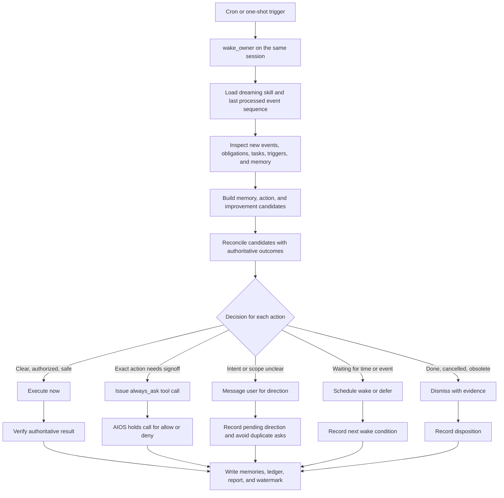

# Dreaming for `eumemic/aios`

## An AIOS-native design for memory consolidation, missed-action recovery, autonomous follow-through, approval, and improvement

**Repository reviewed:** [`eumemic/aios`](https://github.com/eumemic/aios)
**Revision reviewed:** `663f61d22308aaa761f78f18ece5e83d284eb1ec` (`master`, 2026-08-16)
**Status:** architecture and implementation proposal

## Executive recommendation

Build dreaming as a native behavior of each long-lived AIOS session, not as a separate agent framework or an external memory service.

The first version can be composed mostly from capabilities already present in AIOS:

- a versioned `dreaming` skill;
- a writable memory store attached to the session;
- a recurring `cron` trigger whose action is `wake_owner`;
- `search_events`, `list_obligations`, `list_tasks`, `trigger_list`, and `memory_search` for inspection;
- the session's normal tools for completing work;
- `always_ask` permissions and tool confirmations for exact user approval;
- the configured user channel or connector tools for questions and status messages; and
- a durable cursor, action ledger, and dream report in the attached memory store.

The dream should do more than summarize logs. It should:

1. retain durable facts, preferences, decisions, constraints, and lessons;
2. find work the user requested but the runtime did not finish;
3. execute that work when the request remains clear, authorized, and safe;
4. place an exact tool call into AIOS's approval flow when signoff is required;
5. ask the user for direction when intent, scope, or authority is unclear;
6. verify that actions and messages actually succeeded;
7. propose improvements to memories, skills, agents, workflows, and operating policy; and
8. record enough evidence to make every decision auditable and retry-safe.

No open-source project reviewed below supplies that full behavior for AIOS. Several offer useful memory algorithms, but AIOS already has the better control plane: an append-only event log, durable sessions, triggers, obligations, versioned memory, tool permissions, and approval events.

## What “dreaming” means here

Dreaming is a scheduled reconciliation pass over a session's history and present state. It compares what happened with what should have happened, then retains, acts, asks, defers, or dismisses.

It has three distinct outputs:

### 1. Memory maintenance

Extract and retain information likely to matter later:

- stable user preferences;
- explicit decisions and approvals;
- constraints and safety boundaries;
- project state and important outcomes;
- relationships among people, systems, and work;
- corrections to earlier assumptions;
- lessons supported by observed results; and
- unresolved questions worth carrying forward.

Memory maintenance should deduplicate, revise, or supersede old claims. It should preserve provenance rather than turning uncertain inference into fact.

### 2. Commitment reconciliation

Find incomplete or missed work:

- explicit user requests that never received a verified result;
- tool calls that failed or never produced a result;
- promised follow-ups that were not delivered;
- unanswered requests or open obligations;
- child tasks that stalled;
- approvals the runtime is still waiting for;
- scheduled work whose trigger failed or was disabled; and
- messages that were composed but not actually delivered.

The output is not merely a to-do list. The dream should take the next authorized action when it can.

### 3. Improvement reflection

Look for recurring errors or avoidable friction:

- repeated tool failures;
- weak or missing skills;
- prompts that cause the same mistake;
- inefficient workflows;
- missing triggers or observability;
- memories that are stale, conflicting, or hard to retrieve;
- work that should be automated; and
- policies that need a human decision.

Improvement proposals must remain separate from accepted user work. A dream must not silently rewrite its own operating rules merely because it generated a plausible suggestion.

## Why this fits AIOS

AIOS already exposes the right primitives.

| AIOS primitive | Use in dreaming |
|---|---|
| Append-only, gapless session event log | Authoritative history and incremental scan boundary |
| `search_events` | Query messages, tool calls, results, lifecycle events, and spans for the current session |
| Obligations | Find trusted awaited requests that remain open |
| Self-goals | Hold the session to accepted work that should be completed now |
| Detached tasks | Inspect ongoing or stalled delegated work |
| Triggers | Start recurring, one-shot, completion, or external-event reconciliation |
| `wake_owner` | Wake the same long-lived session without creating a new session or obligation |
| Memory stores | Persist versioned memories, cursors, reports, and proposals |
| `memory_search` | Retrieve relevant memories across stores attached to the session |
| Tool permissions | Separate immediately executable tools from tools requiring confirmation |
| Tool confirmation lifecycle | Bind user approval or denial to an exact pending call |
| Skills | Package and version the dream procedure |
| Workflows | Add deterministic orchestration later where it improves replay and observability |

The most important design choice is to run a session's dream in that same session. [`search_events`](https://github.com/eumemic/aios/blob/master/src/aios/tools/search_events.py) is intentionally scoped to the current session. A separate “dream agent” would not automatically see the owner's log and would either lose context or require a new cross-session privilege boundary.

## Proposed architecture



### Components

#### Dreaming skill

A versioned skill should define:

- the scan procedure;
- the evidence hierarchy;
- memory retention rules;
- the action-decision matrix;
- approval and direction-request behavior;
- idempotency rules;
- delivery-verification rules;
- improvement proposal rules; and
- the report schema.

The skill should be the first implementation surface because AIOS already supports agent-callable, versioned skill management through [`skill_upsert` and `skill_archive`](https://github.com/eumemic/aios/blob/master/src/aios/tools/skill_management.py).

#### Same-session wake trigger

Create a per-session trigger similar to:

```json
{
  "name": "daily-dream",
  "source": {
    "kind": "cron",
    "schedule": "0 3 * * *",
    "timezone": "America/Chicago"
  },
  "action": {
    "kind": "wake_owner",
    "content": "Run the dreaming skill over events after the stored watermark. Reconcile memories, unfinished user-authorized work, pending approvals, user questions, and improvement proposals. Verify every action before advancing the watermark."
  }
}
```

`wake_owner` is preferable to starting a child session because it preserves the session-local event view, attached memories, tools, and authority. The injected wake is channel-less; it can prompt the runtime without presenting the trigger text as a user message.

The example matches the current `TriggerCreate` API model. At the revision reviewed, the model supports an IANA `timezone`, but the hand-written `trigger_create` tool schema still omits that field and describes cron as UTC. Until those surfaces are aligned, create the trigger through the API, add `timezone` to the tool schema, or omit it and schedule in UTC.

The schedule should be configurable. Useful modes include:

- nightly for ordinary personal sessions;
- more frequently for operations sessions;
- one-shot after a long task or expected external event;
- `run_completion` after important workflows; and
- manual invocation for testing and recovery.

AIOS currently has no native idle-duration trigger source. Add one only if cron and completion triggers prove insufficient.

#### Dream memory store

Attach a writable memory store and reserve a simple layout:

```text
/mnt/memory/<store>/
  dream/
    state.json
    pending-direction.md
    action-ledger.md
    reports/
      2026-08-17T030000Z.md
    proposals/
      2026-08-17-retry-policy.md
  profile/
    preferences.md
    decisions.md
    constraints.md
    lessons.md
```

Suggested `state.json` fields:

```json
{
  "schema_version": 1,
  "last_completed_event_seq": 1842,
  "last_run_started_at": "2026-08-17T08:00:00Z",
  "last_run_completed_at": "2026-08-17T08:03:14Z",
  "last_report": "dream/reports/2026-08-17T080000Z.md"
}
```

AIOS memory writes are versioned and auditable. Prefer small, provenance-rich memory cards over repeatedly replacing a large summary. Treat memory-store plaintext sensitivity as a deployment constraint: do not retain secrets or unnecessary raw personal data.

## The dream cycle

### 1. Establish an incremental boundary

Read `last_completed_event_seq`. Query events after that sequence in bounded pages. Also inspect a small overlap window before the cursor so the dream can recognize outcomes that span a prior boundary.

Never advance the cursor at the start of a run. Advance it only after all decisions, action results, memory writes, and the run report are durable.

### 2. Read authoritative current state

Use the narrowest existing views:

- `events_search` for user and assistant messages;
- `tool_calls_search` for paired calls, results, errors, and acknowledgements;
- `lifecycle_search` for requests, responses, confirmations, triggers, and turn endings;
- `spans_search` for execution diagnostics;
- `list_obligations` for current open awaited requests;
- `list_tasks` for detached agent, session, or workflow work;
- `trigger_list` for future commitments; and
- `memory_search` plus direct file reads for relevant retained context.

[`search_events`](https://github.com/eumemic/aios/blob/master/src/aios/tools/search_events.py) already supplies session-scoped, read-only SQL views with bounded results. The dream should page by sequence or call ordinal, not ask for an unbounded transcript dump.

### 3. Build three candidate sets

#### Memory candidates

Each candidate should contain:

- proposed memory text;
- type: preference, decision, constraint, fact, outcome, or lesson;
- source event sequence or tool result;
- confidence;
- relevant scope and expiry, if any;
- relationship to existing memory: new, confirm, revise, supersede, or conflict; and
- sensitivity classification.

#### Action candidates

Each candidate should contain:

- concise desired outcome;
- exact proposed next action;
- canonical tool name and arguments, if known;
- source event sequences proving the request or approval;
- current completion evidence;
- cancellation or supersession evidence;
- risk and reversibility;
- required permission or signoff;
- idempotency key or action digest; and
- current disposition.

#### Improvement candidates

Each candidate should contain:

- observed pattern, not a single unsupported hunch;
- event, span, or outcome evidence;
- proposed change;
- expected benefit;
- risk and rollback plan;
- evaluation method; and
- whether the change requires user approval.

### 4. Reconcile against outcomes

Before treating work as incomplete, check whether it already succeeded.

Important examples:

- A polished assistant reply does not prove an external message was delivered.
- A tool-call event does not prove the tool completed successfully.
- A child task that started may still be running, failed, or have a usable result.
- An open-loop sentence in an old message may have been cancelled later.
- An approval may bind only to one exact tool call, not a broader category of work.

For connector sends, require a successful result and an authoritative acknowledgement such as a message ID when the connector provides one.

### 5. Classify every action

Use this decision matrix.

| Disposition | Required conditions | Dream behavior |
|---|---|---|
| **Execute now** | The user explicitly requested or previously approved it; the request remains current; target and arguments are clear; the action is within current authority; policy does not require signoff; risk is acceptable | Execute through the normal tool surface, verify the result, and record evidence |
| **Request exact approval** | The action is clear, but a tool is `always_ask` or policy requires signoff | Issue the exact tool call so AIOS holds that call for allow or deny; do not substitute a vague prose request |
| **Ask for direction** | Goal, target, parameters, priority, conflicts, or consequences are materially unclear | Message the user with one concise question, the relevant finding, the proposed default, and its consequence |
| **Defer** | Work is authorized but must wait for a time, result, or external event | Create a one-shot wake, use a suitable trigger, or defer a current obligation; record the wake condition |
| **Dismiss** | Work is fulfilled, cancelled, superseded, obsolete, duplicated, or unauthorized | Record the evidence and take no action |

### 6. Execute authorized work

“Already asked for” must mean more than “the model thinks this would be helpful.” Auto-execution requires evidence in the event log or a versioned standing policy.

Before executing, the dream must verify:

1. the source is a genuine user message, confirmation event, or approved policy;
2. later events did not cancel, replace, or narrow it;
3. the proposed action is a direct continuation of that request;
4. exact parameters can be derived without making a material product, financial, privacy, or destructive choice;
5. the action remains relevant;
6. the tool is available under the session's current attenuated capability; and
7. retrying will not duplicate an already completed side effect.

Record the authorization source by exact event sequence, tool-call ID, confirmation event, or skill/policy version. Never treat an assistant suggestion as user authorization.

### 7. Obtain approval or direction

AIOS's [`ToolSpec.permission`](https://github.com/eumemic/aios/blob/master/src/aios/models/agents.py) supports `always_allow` and `always_ask`. An `always_ask` call remains unresolved until a client allows or denies it through the tool-confirmation API. This is the preferred signoff path because approval binds to the exact tool call and arguments.

Use two different interaction patterns:

#### Exact action, signoff required

Issue the tool call under `always_ask`. The user should see:

- the action;
- exact target and arguments;
- why it is being proposed;
- the earlier request or policy that led to it; and
- any material consequence.

The runtime resumes only after allow or deny.

#### Intent or parameters unclear

Send a normal user-facing message. A good question is short and actionable:

> You asked me to send the final report, but two recipients appear in the thread and neither was selected. I recommend sending it to the project owner only. Should I do that, or send it to both recipients?

Store a pending-direction record with a stable action digest and `last_asked_at`. Do not ask the same unresolved question every night. A configurable reminder or one-shot follow-up can be scheduled when appropriate.

The exact outbound path depends on deployment. Use the configured connector's send tool or the client mechanism that delivers session output to the user. Then verify delivery from the tool result; a channel-less `wake_owner` event itself is not a user notification.

### 8. Retain memories and proposals

Memory writes should:

- cite source event sequences or outcome records;
- separate observed facts from inference;
- preserve explicit uncertainty;
- revise conflicts rather than silently retaining both as current truth;
- minimize sensitive content;
- avoid copying full logs when a concise memory suffices; and
- keep pending actions separate from durable user facts.

Improvement proposals should be written to `dream/proposals/` until accepted. Changes to skills, agent configuration, tools, or workflows should normally use `always_ask` unless an explicit standing policy authorizes that class of self-change.

### 9. Verify and commit the run

A run is complete only after:

- each attempted tool call has a terminal result or an explicit pending-approval state;
- external delivery has an acknowledgement when available;
- new memories are readable;
- deferred work has a valid wake condition;
- unresolved questions are in the pending-direction ledger;
- the report lists every disposition and its evidence; and
- `last_completed_event_seq` is advanced atomically at the logical end.

On crash or retry, recompute action digests and inspect the authoritative event log before repeating side effects.

## Authority and safety model

### Preserve capability attenuation

A dream must never gain a broader tool surface than the waking session. AIOS's current confirmation path re-checks capability before dispatch, which preserves attenuation even after a delayed approval.

### Configure narrow tools

The dream should prefer typed tools with narrow targets. Avoid granting unrestricted `bash` as `always_allow` to an autonomous dream. The current permission is primarily tool-level; a broad shell tool gives the model far more authority than a narrow action tool.

Recommended defaults:

| Tool category | Suggested permission |
|---|---|
| Event, memory, obligation, task, and trigger reads | `always_allow` |
| Writes to the dedicated dream/profile memory store | `always_allow` if scoped safely |
| Reversible, low-risk work explicitly covered by user request | `always_allow` where a narrow typed tool exists |
| External messages within an explicit request | Policy-dependent; verify delivery |
| Financial, destructive, privacy-sensitive, publication, deployment, or account changes | `always_ask` |
| Skill, agent, tool-surface, and workflow modifications | `always_ask` by default |
| Broad shell or generic arbitrary HTTP access | Omit or use `always_ask` |

One plausible tool configuration is:

```json
[
  {"type": "search_events", "permission": "always_allow"},
  {"type": "memory_search", "permission": "always_allow"},
  {"type": "read", "permission": "always_allow"},
  {"type": "write", "permission": "always_allow"},
  {"type": "edit", "permission": "always_allow"},
  {"type": "list_obligations", "permission": "always_allow"},
  {"type": "list_tasks", "permission": "always_allow"},
  {"type": "trigger_list", "permission": "always_allow"},
  {"type": "schedule_wake", "permission": "always_allow"},
  {"type": "skill_upsert", "permission": "always_ask"},
  {"type": "update_agent", "permission": "always_ask"},
  {"type": "update_workflow", "permission": "always_ask"},
  {"type": "bash", "permission": "always_ask"}
]
```

This is illustrative. A production deployment should scope memory mounts and external tools to the user's actual policy.

### Distinguish obligations, goals, and scheduled work

AIOS's [`list_obligations`](https://github.com/eumemic/aios/blob/master/src/aios/tools/list_obligations.py) exposes current open awaited requests. Current source also ships reflexive self-goals through [`create_goal`](https://github.com/eumemic/aios/blob/master/src/aios/tools/goal_management.py).

Use them carefully:

- Use an obligation for an actual awaited request-response relationship.
- Use a self-goal only for accepted work the session should pursue now. An open self-goal prevents clean idle and can create churn while waiting.
- For work waiting on time or an external event, use `schedule_wake`, a one-shot trigger, or a relevant event trigger.
- For clear work waiting on user signoff, issue the exact `always_ask` tool call.
- For ambiguous work, message the user and record pending direction; do not create a self-goal that repeatedly nudges itself while no answer exists.

### Harden semantic authorization later

The MVP can use the skill's evidence rules and existing event log. A hardened version should add a structured pre-dispatch audit record:

```json
{
  "action_digest": "sha256:...",
  "tool": "connector.send_message",
  "canonical_arguments_hash": "sha256:...",
  "decision": "execute_now",
  "authorization_kind": "explicit_user_request",
  "authorization_event_seqs": [1774],
  "risk": "low",
  "decided_at": "2026-08-17T08:02:11Z"
}
```

This does not replace confirmation. It makes auto-execution decisions inspectable and binds the claimed authorization to the exact action. Higher-risk classes should still require `always_ask` regardless of semantic evidence.

## Avoiding loops and false work

The dream must distinguish user-originated commitments from its own artifacts.

Rules:

- Do not interpret the recurring `wake_owner` prompt as a user request.
- Tag dream reports, questions, and proposals with a run ID and action digest.
- Do not convert an improvement proposal into an authorized task.
- Do not reopen a fulfilled action because its acknowledgement appeared before the scan cursor.
- Do not re-send a question or external message when an equivalent digest is pending or verified.
- Re-scan a small overlap window, but deduplicate by stable IDs and authoritative tool results.
- Treat new user instructions as capable of cancelling or superseding old ones.
- Stop or ask when two valid instructions conflict.

## Observability

The first version can write a Markdown report into the memory store. Each report should include:

- run ID, start/end time, and scanned event range;
- memories added, revised, superseded, or rejected;
- action candidates and dispositions;
- actions executed and verified;
- exact approvals awaiting a decision;
- questions sent to the user;
- deferred work and wake conditions;
- improvement proposals;
- errors and incomplete verification; and
- the final cursor value.

Small AIOS core additions would improve inspection:

- lifecycle events: `dream_started`, `dream_completed`, `dream_action_decided`, and `dream_action_executed`;
- inclusion of those events in `lifecycle_search`;
- a compact dream-run projection for operators; and
- metrics for candidates, verified actions, duplicates prevented, approvals, questions, and memory revisions.

These should be observability additions, not a second source of truth.

## Relationship to current AIOS memory work

Two open AIOS issues overlap part of this design:

- [Issue #1370: Memory intelligence layer](https://github.com/eumemic/aios/issues/1370) covers profile auto-injection, memory search, and periodic memory distillation. `memory_search` is already present in current source.
- [Issue #1373: Cron-driven memory distillation workflow](https://github.com/eumemic/aios/issues/1373) proposes immutable memory-card distillation and still needs design decisions.

Dreaming should build on that work but has a broader contract. Memory distillation alone does not reconcile missed actions, collect exact approval, ask the user for direction, verify external effects, or propose operational improvements.

A useful division is:

- #1370/#1373: memory intelligence and distillation substrate;
- dreaming skill: session-level reconciliation and decisions;
- existing AIOS permissions and confirmations: approval enforcement;
- existing triggers: wake and retry mechanics; and
- optional new lifecycle events: dream observability.

## Open-source projects worth considering

No reviewed project should replace the AIOS event log or authority model. Consider these as sources of algorithms or optional memory backends.

### [MemKraft](https://github.com/seojoonkim/memkraft)

**Best fit:** inspiration for memory maintenance, provenance, open-loop detection, dry runs, and outcome ledgers.

Why consider it:

- focuses on agent memory maintenance rather than only retrieval;
- models consolidation and deduplication;
- emphasizes provenance and inspectable changes; and
- has concepts close to memory “sleep” or maintenance passes.

Limits for this use case:

- it does not replace AIOS obligations, triggers, tool confirmations, or capability attenuation;
- AIOS should remain the authoritative source for messages and action outcomes; and
- its useful parts should be adapted behind the dreaming skill rather than allowed to create a second control plane.

**Recommendation:** strongest project to study for the memory-maintenance portion.

### [Hindsight](https://github.com/vectorize-io/hindsight)

**Best fit:** a richer retain/recall/reflect memory substrate.

Why consider it:

- explicitly supports reflection over stored experience;
- offers structured memory operations; and
- may improve synthesis across a large history.

Limits:

- reflection is not action reconciliation;
- it does not supply AIOS-native approval or user-direction behavior; and
- adopting it introduces another service and data model.

**Recommendation:** evaluate only if AIOS's file-backed memory plus FTS cannot meet retrieval and reflection quality targets.

### [Graphiti](https://github.com/getzep/graphiti)

**Best fit:** temporal relationships, changing facts, and provenance-rich memory graphs.

Why consider it:

- useful when facts change over time;
- can represent entities and relationships across long-running work; and
- may help resolve superseded decisions or conflicting historical claims.

Limits:

- a temporal graph is not a follow-through engine;
- it does not decide or enforce whether an action is authorized; and
- graph infrastructure may be excessive for an initial AIOS implementation.

**Recommendation:** consider later for multi-project or multi-entity memory, not for the MVP.

### [Mem0](https://github.com/mem0ai/mem0)

**Best fit:** general persistent memory extraction and retrieval.

Why consider it:

- broad integrations and a familiar memory API;
- useful baseline for memory extraction quality; and
- easier to benchmark than a bespoke memory stack.

Limits:

- it addresses persistent memory, not the full dream cycle;
- it does not replace session-event reconciliation or approvals; and
- an external store can create consistency and provenance problems unless AIOS remains authoritative.

**Recommendation:** use as a benchmark or optional extraction provider, not as the dreaming architecture.

### [Letta trajectory](https://github.com/letta-ai/trajectory)

**Best fit:** importing and normalizing transcripts from other agent systems.

Why consider it:

- useful if AIOS must dream over legacy histories produced elsewhere; and
- helps convert heterogeneous execution traces into a common form.

Limits:

- native AIOS sessions already have a richer structured event log; and
- transcript normalization does not provide action authority or approval.

**Recommendation:** use only for migration or cross-runtime ingestion.

### [Letta Code](https://github.com/letta-ai/letta-code)

**Best fit:** reference implementation for long-lived, stateful agent behavior.

Why consider it:

- offers design comparisons for persistent agents and memory management; and
- may provide useful evaluation ideas.

Limits:

- it is a separate runtime with different state and control assumptions; and
- replacing AIOS primitives would add integration cost without solving AIOS-specific authorization.

**Recommendation:** study, do not adopt as the AIOS dream controller.

## Build-versus-adopt decision

| Requirement | AIOS native | External project needed? |
|---|---:|---:|
| Authoritative session history | Yes | No |
| Incremental log scan | Yes | No |
| Open obligations and tasks | Yes | No |
| Recurring wake | Yes | No |
| Versioned memory writes | Yes | No |
| Full-text memory retrieval | Yes | No |
| Exact per-call user confirmation | Yes | No |
| Execute approved work with existing tools | Yes | No |
| Message user for direction | Deployment connector/client | No new memory system |
| Memory consolidation quality | Basic substrate | Optional algorithms may help |
| Temporal knowledge graph | No | Optional later |
| Structured dream observability | Partial | Small AIOS addition preferred |
| Semantic binding of prior request to auto-action | Prompt/audit in MVP | Small AIOS hardening preferred |

**Decision:** implement the control loop natively in AIOS. Borrow or benchmark memory algorithms only after the native end-to-end behavior works.

## Implementation plan

### Phase 0: Evaluation fixture

Create a repeatable event-log fixture containing:

- a completed user request;
- a missed explicit request;
- a failed tool call;
- a sent message with acknowledgement;
- a composed but undelivered message;
- a cancelled request;
- a clear action requiring approval;
- an ambiguous request requiring direction;
- a deferred action; and
- conflicting or superseded memory facts.

Define the expected disposition and evidence for each item before implementing the prompt.

### Phase 1: Native MVP, little or no core code

1. Create a dedicated versioned `dreaming` skill.
2. Attach a writable memory store with the proposed layout.
3. Configure narrow inspection and action tools.
4. Mark sensitive and self-modifying tools `always_ask`.
5. Add a per-session cron trigger using `wake_owner`.
6. Implement incremental scanning and the three candidate sets.
7. Implement the five-way action matrix.
8. Verify tool and delivery outcomes before recording completion.
9. Write dream reports and advance the cursor only at commit.
10. Run in report-only mode, then approval-only mode, before enabling selected auto-actions.

### Phase 2: AIOS observability and hardening

Add:

- structured dream lifecycle events;
- an action-decision audit schema bound to canonical arguments;
- a dream-run projection/API;
- better route or argument-level policies for broad tools if needed;
- idle-trigger support if evidence justifies it; and
- automatic deduplication metrics and retry diagnostics.

### Phase 3: Memory intelligence

Coordinate with #1370 and #1373:

- immutable or versioned memory cards;
- profile auto-injection where appropriate;
- conflict and supersession handling;
- evidence-aware confidence decay;
- evaluation against MemKraft, Hindsight, Mem0, or Graphiti; and
- retention and privacy policies.

### Phase 4: Account-wide dreaming, only if required

A single account-wide dream spanning many sessions would require a new operator-level, account-scoped projection or service. It must preserve tenant and session isolation and should emit actions back through each owning session's authority surface.

Do not solve this by granting an ordinary agent unrestricted access to every session log.

## Acceptance criteria

### Functional

- Retains important durable information with provenance.
- Revises or supersedes conflicting memories instead of blindly appending both.
- Finds an explicit missed request in the evaluation fixture.
- Does not reopen a completed, cancelled, or superseded request.
- Executes a clear, low-risk, currently authorized action.
- Places a clear sensitive action into exact `always_ask` confirmation.
- Sends a concise question when a material parameter is missing.
- Defers time-dependent work with a valid wake condition.
- Verifies external side effects before marking them complete.
- Produces a readable report and safely advances its cursor.

### Safety

- Never treats its own suggestion as user authorization.
- Never widens the session's tool capability.
- Never repeats an external side effect after a crash/retry when success can be proven.
- Never interprets its trigger prompt as new user work.
- Never repeatedly nags the user about an unchanged pending question.
- Never applies an improvement proposal without the required approval.
- Does not store secrets or unnecessary raw logs in memory.

### Quality metrics

- precision and recall for missed explicit requests;
- false-action rate;
- duplicate-side-effect rate;
- percentage of actions with valid authorization evidence;
- percentage of external actions with verified acknowledgements;
- approval acceptance and denial rates;
- repeated-question rate;
- memory contradiction and supersession rate;
- retrieval success for retained memories; and
- cost and latency per dream run.

## Recommended first deliverable

Ship one session-level, report-first prototype:

- nightly `wake_owner` trigger;
- versioned `dreaming` skill;
- attached dream memory store;
- incremental `search_events` scan;
- obligations/tasks/triggers reconciliation;
- action candidates with authorization evidence;
- exact `always_ask` approval for sensitive tools;
- one user-direction message path with delivery verification;
- durable report and cursor; and
- a fixture-backed test suite.

After the report-only results are accurate, enable automatic execution only for narrow, reversible action classes. Keep higher-risk classes behind exact confirmation.

That sequence gives AIOS genuine follow-through without creating an unaudited autonomous side channel.

## Primary AIOS sources

- [`eumemic/aios` README](https://github.com/eumemic/aios/blob/master/README.md)
- [`search_events` implementation and searchable views](https://github.com/eumemic/aios/blob/master/src/aios/tools/search_events.py)
- [Obligation derivation](https://github.com/eumemic/aios/blob/master/src/aios/harness/obligations.py)
- [`list_obligations`](https://github.com/eumemic/aios/blob/master/src/aios/tools/list_obligations.py)
- [Self-goal management](https://github.com/eumemic/aios/blob/master/src/aios/tools/goal_management.py)
- [Trigger model](https://github.com/eumemic/aios/blob/master/src/aios/models/triggers.py)
- [`wake_owner` and trigger execution service](https://github.com/eumemic/aios/blob/master/src/aios/services/triggers.py)
- [`memory_search`](https://github.com/eumemic/aios/blob/master/src/aios/tools/memory_search.py)
- [Memory-store service](https://github.com/eumemic/aios/blob/master/src/aios/services/memory_stores.py)
- [Agent tools and permission model](https://github.com/eumemic/aios/blob/master/src/aios/models/agents.py)
- [Session API, including tool confirmation](https://github.com/eumemic/aios/blob/master/src/aios/api/routers/sessions.py)
- [Skill management](https://github.com/eumemic/aios/blob/master/src/aios/tools/skill_management.py)
- [Issue #1370: memory intelligence layer](https://github.com/eumemic/aios/issues/1370)
- [Issue #1373: cron-driven memory distillation](https://github.com/eumemic/aios/issues/1373)
